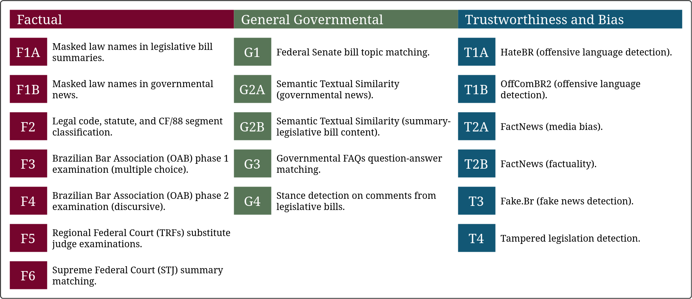

# Ulysses SentEval: evaluation of sentence embeddings in Brazilian legal domain
WIP.



1. [Installation](#installation)
2. [Task list](#task-list)
3. [Evaluation specifications](#evaluation-specifications)
4. [Examples](#examples)
5. [License](#license)
6. [Citation](#citation)

---

## Instalation

```bash
python -m pip install -U "git+https://github.com/ulysses-camara/ulysses-senteval"
```

---

## Task list

Task ID | Category | 
:--     | :--      |
TO      | DO.      |

---

## Evaluation specifications

WIP.

---


## Examples

Below we provide a minimal usage example to evaluate a Sentence Transformer:

```python
import ulysses_senteval
import sentence_transformers

sbert = sentence_transformers.SentenceTransformer("path/to/sbert", device="cuda:0")
evaluator = ulysses_senteval.UlyssesSentEval(sbert)
res = evaluator.evaluate()

print(res)
```

TODO:
- Cache options;
- Other embedding architectures.
- Multiprocessing;

---

## License
[MIT.](./LICENSE)

---

## Citation

```bibtex
WIP.
```
